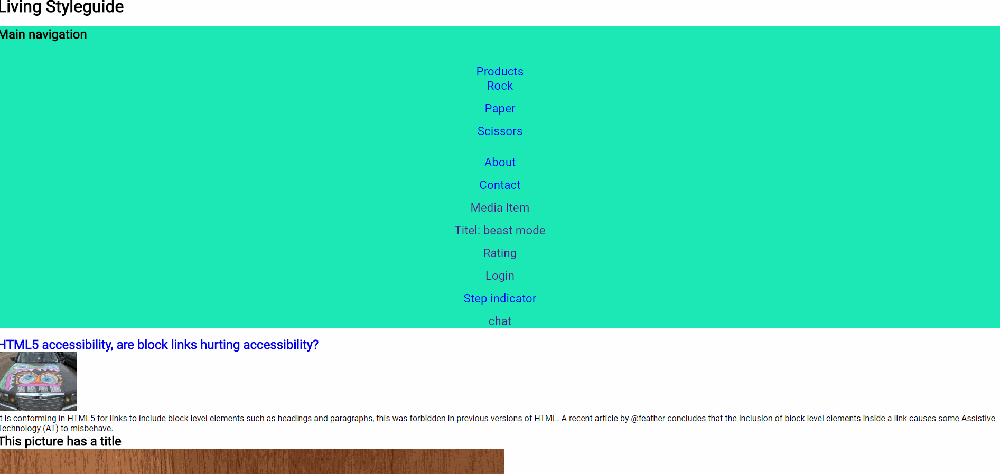

# Feedback
I would like to have feedback on the use of the grid layout.

# Requirements 

-The site is usable with an keyboard.
-An spasmatic person is able to use the site.

# Proces

When starting this project, I load all the components  into one html file. What this achieve, is that it will give us an overview of what kind of contents we have to work with. From there I structured it in a away that makes it logical and more readable. 

```
Login > Navigation > Media-item > Picture > Rating > Step-indicator > Chat 
```

For this project I want to use CSS Grid, but because I have yet to learn it, I need to find resources that help me understand just that. For that I went to [CssGridGarden](http://cssgridgarden.com/), that teaches us the basic grid functions. And the second resource is taken from [Coding Tech](https://www.youtube.com/watch?v=7kVeCqQCxlk), that teaches us the basic idea how we can implement grid into our site. The takeaway of Coding Tech:

1. Make it accessible
2. Make it fancy
3. Make sure the fancy doesn't break the accessibility

## HTML
When making the HTML, I made sure that every components is accessible with the keyboard. How did I do that? From the navigation you're able to go to every component desired, but to make this possible **every components must have an ID**, because without it, you're not able to skip to the components from the navigation.

Also I **removed** to **autofocus** from the login form, because else, it will jump immediately to the form, but we don't want that. 

After that I went researching for techniques that can be implement to make the site more accessible. [WebAIM](https://webaim.org/techniques/skipnav/#maincontent) give us an example: a link that let the user skip the navigation and go immediately to the main content. I find this an usefull feature so I immediately implemented on the site. To achieve this. I've wrapped everything (except the navigation) into a main tag. And implemented an achor that bring us to the main content. 


# grid
After immplemented the basic funtion I designed the grid layout to put the component in. 

The initital design was to be able to horizontal scroll in the main content, but sommehow the content never overflow so we were not able to accomplish it. 
So instead I just set a maximum width and the user is able to scroll up and down.


*after*


# What have I learned
Creating a layout with CSS Grid and making use of the _grid-template-area_ to gives name to the grid. And assign components in the area.

## inspiration
https://codepen.io/dsenneff/full/QajVxO/